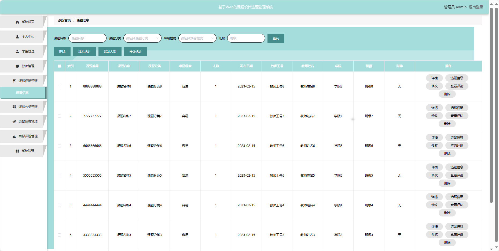

基于Springboot的课程设计选题管理系统（程序+论文）
=
### 完整代码获取地址：从戎源码网 ([https://armycodes.com/](https://armycodes.com/))
### 作者微信：19941326836  QQ：952045282 
### 承接计算机毕业设计、Java毕业设计、Python毕业设计、深度学习、机器学习
### 选题+开题报告+任务书+程序定制+安装调试+论文+答辩ppt 一条龙服务
### 所有选题地址https://github.com/nature924/allProject

一、项目介绍
---
基于Spring Boot框架实现的课程设计选题管理系统，系统包含三种角色：管理员、用户,教师主要功能如下。
### 【用户功能】

系统首页：浏览课程设计选题管理系统的信息。
个人中心：管理个人信息，查看选题进展和历史记录。
课题信息管理：浏览已有的课题信息。
选题信息管理：查看已选择的选题信息。
自拟课题管理：提出和管理个人自拟的课题，。
系统管理：修改个人密码。

### 【管理员功能】

系统首页：查看系统整体概况。
个人中心：管理个人信息。
学生管理：审核和管理注册学生用户的信息。
教师管理：审核和管理注册教师用户的信息。
课题信息管理：监管和管理系统中的课题信息，包括发布、编辑、删除等。
课题分类管理：管理课题的分类信息。
选题信息管理：查看学生已选题目的情况，包括审批和管理选题流程。
自拟课题管理：审批和管理学生提出的自拟课题。
系统管理：管理系统的基本设置。

### 【教师功能】

系统首页：查看系统。
个人中心：管理个人信息。
课题信息管理：浏览已有的课题信息。
课题分类管理：管理课题的分类信息。
选题信息管理：查看学生已选题目的情况。
自拟课题管理：提出和管理个人自拟的课题。
系统管理：校园资讯管理。

二、项目技术
---
- 编程语言：Java
- 数据库：MySQL
- 项目管理工具：Maven
- 前端技术：VUE、HTML、Jquery、Bootstrap
- 后端技术：Spring、SpringMVC、MyBatis

三、运行环境
---
- 操作系统：Windows、macOS都可以
- JDK版本：JDK1.8以上都可以
- 开发工具：IDEA、Ecplise、Myecplise都可以
- 数据库: MySQL5.7以上都可以
- Tomcat：任意版本都可以
- Maven：任意版本都可以

四、运行截图
---
### 论文截图：

### 程序截图：

